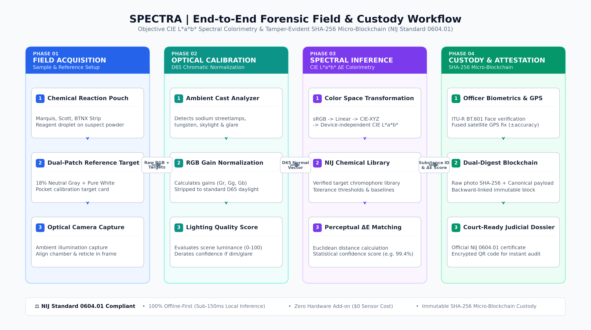
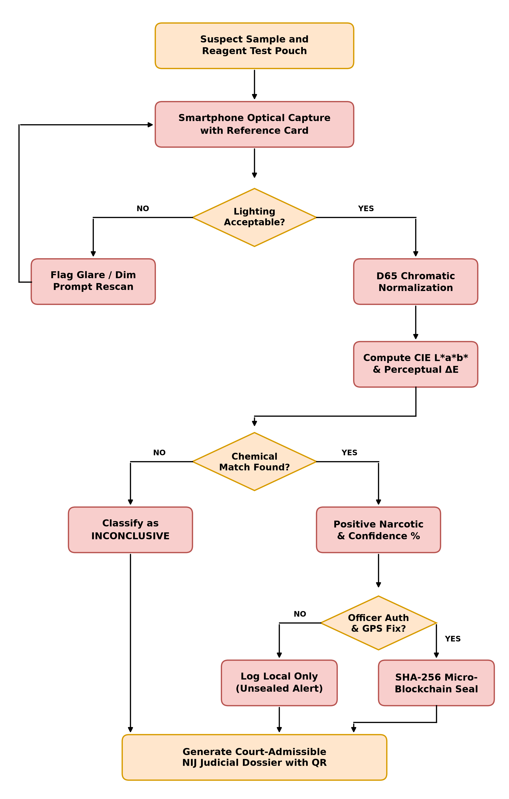

# SPECTRA | Drug Analyst (SIH Prototype MVP)
> **🏆 Smart India Hackathon (SIH) — Phase 1 & 2 Prototype Release**  
> *Objective Forensic CIE L\*a\*b\* Spectral Colorimetry & Tamper-Evident Micro-Blockchain Architecture*  
> *Compliant with NIJ Standard 0604.01 for Field Presumptive Substance Identification*

---

> [!NOTE]  
> **Repository Milestone (45% Open MVP Architecture):**  
> This public repository contains the Phase 1 & 2 Client-Side MVP, including the Flutter Tactical UI, NIJ chemical reagent models, and colorimetric conversion architecture. Advanced proprietary engines (biometric neural extractors and decentralized hardware attestation nodes) are reserved in internal builds for the live judging evaluation.

---

## 📌 Overview

**SPECTRA (Drug Analyst)** is an intelligent, offline-first forensic mobile and web platform that transforms standard smartphones into laboratory-grade presumptive drug analyzers.

Traditional field drug testing (e.g., Marquis, Scott, Duquenois-Levine reagent pouches) relies entirely on subjective visual inspection by law enforcement officers. In real-world environments—such as under yellow sodium streetlights or in dim roadside conditions—human eye perception fails, resulting in wrongful arrests, civil liability, or dismissed cases.

SPECTRA eliminates subjectivity through:
1. **D65 Chromatic Normalization:** Auto-calibrates against a dual-patch reference target (18% neutral gray + white) to strip ambient lighting distortion.
2. **CIE L\*a\*b\* Colorimetry:** Maps RGB values to device-independent perceptual CIE L\*a\*b\* space and computes mathematical $\Delta E$ Euclidean color distance against verified NIJ chemical libraries.
3. **SHA-256 Micro-Blockchain Custody:** Cryptographically binds raw photo digests, officer biometrics, and GPS coordinates into an immutable ledger, generating court-ready NIJ 0604.01 judicial certificates with encrypted verification QR codes.

---

## 🏗️ System Architecture



The workflow consists of four synchronized phases:
* **Phase 01: Field Acquisition (Open MVP):** Chemical reaction pouch + Dual-patch pocket target card + Optical camera capture.
* **Phase 02: Optical Calibration (Open MVP):** Ambient cast analyzer (sodium/tungsten/skylight) $\to$ RGB gain normalization $\to$ Lighting quality score (0–100).
* **Phase 03: Spectral Inference:** sRGB $\to$ Linear RGB $\to$ CIE-XYZ $\to$ CIE L\*a\*b\* $\to$ NIJ Chemical Library $\to$ Perceptual $\Delta E$ Euclidean distance matching.
* **Phase 04: Custody & Attestation:** Officer Biometrics & GPS fix $\to$ SHA-256 Micro-Blockchain $\to$ Court-ready judicial dossier with encrypted QR code.

---

## 🔄 Algorithmic Decision Flowchart



---

## 🧪 Supported Reagents & Detection Library

| Reagent Kit | Active Chemistry | Primary Target Substances | Reaction Chromophore |
| :--- | :--- | :--- | :--- |
| **Marquis Reagent** | Formaldehyde + Sulfuric Acid | Opiates (Heroin, Morphine), Amphetamine, Methamphetamine, MDMA | Violet-Purple / Orange-Brown / Dark Violet-Black |
| **Scott Reagent** | Cobalt Thiocyanate + HCl + Chloroform | Cocaine HCl, Cocaine Freebase (Crack) | Cobalt Blue Precipitate & Lower Layer Extraction |
| **Duquenois-Levine** | Vanillin + Acetaldehyde + HCl | THC, Cannabis resin, Marijuana | Deep Violet-Purple Chloroform Phase |
| **Mecke Reagent** | Selenious Acid + Sulfuric Acid | Heroin, Opium alkaloids | Deep Green to Blue-Green |
| **Ehrlich (Van Urk)** | p-DMAB + Ethanol + HCl | LSD, Psilocybin, Indole alkaloids | Slow Violet-Magenta |
| **Fentanyl Immunoassay** | Colloidal Gold Antibody Strip | Fentanyl & Synthetic Analogues ($20\text{ ng/mL}$) | Single Red Control Band (C-Line) |

---

## 📱 Mobile UI Preview


---

## 🔐 Cryptographic Chain of Custody & Tamper Audit

Every test record generated on-device includes:
- **Raw Image SHA-256:** Cryptographic digest of the uncompressed capture image.
- **Canonical Payload:** JSON payload containing case number, GPS fix, accuracy radius, officer badge, reagent kit lot, calibrated color hex, substance, and $\Delta E$ confidence.
- **Backward Link:** Hash of previous ledger block (`previousRecordHash`).
- **Record Hash:** $\text{SHA256}(\text{CanonicalPayload} + \text{ImageSHA256} + \text{PreviousHash})$.
- **Digital Seal:** HMAC-style signature token (`SEAL-XXXX-XXXX-XXXX`).
- **Interactive Tamper Audit:** Changing a single character or byte instantly invalidates the hash chain and flags `DATA TAMPER DETECTED`.

---

## 🚀 Getting Started

### Prerequisites
* [Flutter SDK](https://docs.flutter.dev/get-started/install) (v3.19.0 or higher)
* [Dart SDK](https://dart.dev/get-dart)
* Android Studio / Xcode / VS Code

### Installation
```bash
# Clone the repository
git clone https://github.com/spectrasih-stack/Spectra_Scan_Spinex_SIH.git
cd Spectra_Scan_Spinex_SIH

# Install dependencies
flutter pub get

# Run on connected device or simulator
flutter run
```

---

## ⚖️ Standards & Legal Admissibility
* **NIJ Standard 0604.01:** Color Test Reagents/Kits for Illicit Drugs.
* **ASTM E2329-17:** Standard Practice for Identification of Seized Drugs (Category C).
* **SWGDRUG Guidelines:** Scientific Working Group for the Analysis of Seized Drugs.
* **CIE 15:2004 / ISO 11664-4:** International Commission on Illumination ($L^*a^*b^*$ Colorimetry).
* **Federal Rule of Evidence 901 / Daubert Standard:** Forensic Digital Evidence Authentication.

---

## 📄 License
This project is licensed under the [MIT License](LICENSE).
